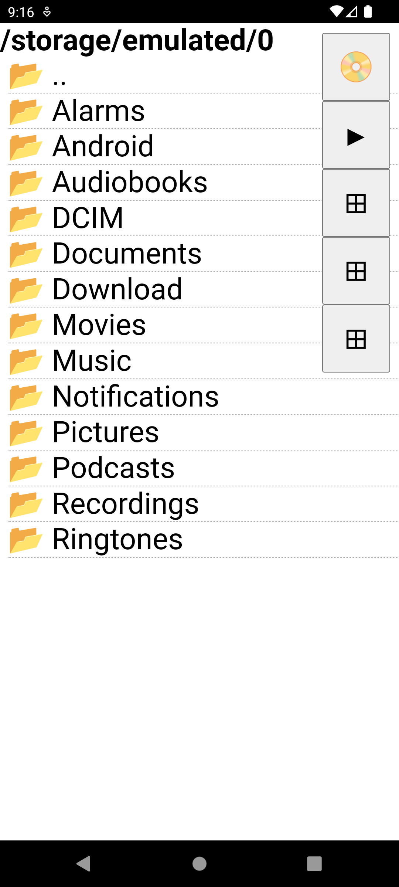

# MAAR (My Android Auto Radio)

With python3's [htag](https://github.com/manatlan/htag) module.

Android's Apk built thru the [htagapk recipe](https://github.com/manatlan/htagapk)

To build : you can use the **Build github's action** or [make.py](make.md)

## notes

This is a (working) POC, just to see if the whole idea is OK.

history:  I've got an android auto radio, with a 1280x480 (6.86") ... I don't like the current music player. So i try to replace it with something of my own.
It's just to try if an android apk, using htag, can replace the current app.

You can test the [APK on appetize](https://appetize.io/app/gutxl5u4tznjq4v6ocu3peinba) (but there are no mp3 in the appetize vm, so you can't go further)

 

Basically, it's a "folder browser" which let you play mp3s. It will automatically create a playlist of random ones (those in the same or children/descending folders).  You can play/pause by clicking on the cover (issued from mp3 tag), or increase/decrease volume.

And when it restarts, it will continue where it ended. (the 3 square/cross buttons are other paths on the device (usb/mass storage), to try ;-)).
